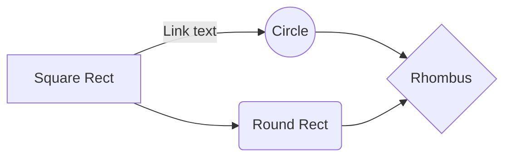

# Sample Markup in GitHub
### BOLD
- This is **Bold_01**,  __BOLD 02__

### ITALICS
- *italicized text*

### BlockQuote
> Blockquote.

### Blockquotes Nested
> Blockquote.
>> Nested

### Blockquotes Elements
> Blockquote
> - Revenue was off the chart.
> - Profits were higher than ever.

### List Ordered
Ordered List
1. First item
2. Second item

### List Unordered
Unordered List
- First item
- Second item

### List Unordered Indented
Unordered List
- Third item
  - Indented item
  - Indented item

### Horizontal Rule
---
                   
### Line Break
First line with the HTML tag after. 

### Table
| NUMBER |                ITEM           |
|:-----: | :----------------------------:|
|   1    | Test 1                        |
|   2    | Test 2                        |

### Strikethrough
~~The world is flat.~~ We now know that the world is round. 

### Subscript
H~2~O 
H2O

### Superscript
X^2^  
X2

### Image

### Footnote
Here's a sentence with a footnote. [^1]
...
[^1]: This is the footnote.

### Definition
term
: definition

### Task List
- [x] Write the press release
- [ ] Update the website
- [ ] Contact the media

### Note
> __Note__
> This is a note.

### Warning
> __Warning__
> This is a warning.

### End

