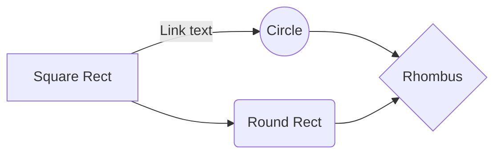

# Sample Markdown in GitHub

### BOLD
- This is **Bold_01**,<br> __BOLD 02__

***
### ITALICS
- *italicized text*

***
### BlockQuote
> Blockquote.

***
### Blockquotes Nested
> Blockquote.
>> Nested

***
### Blockquotes Elements
> Blockquote
> - Revenue was off the chart.
> - Profits were higher than ever.

***
### List Ordered
Ordered List
1. First item
2. Second item

***
### List Unordered
Unordered List
- First item
- Second item

***
### List Unordered Indented
Unordered List
- Third item
  - Indented item
  - Indented item

***
### Horizontal Rule
---
   
***
### Line Break
First line with the HTML tag after.<br>

***
### Table
| NUMBER |                ITEM           |
|:-----: | :----------------------------:|
|   1    | Test 1                        |
|   2    | Test 2                        |


***
### Strikethrough
~~The world is flat.~~ We now know that the world is round.<br>

***
### Subscript
H~2~O<br>
H<sub>2</sub>O

***
### Superscript
X^2^<br> 
X<sup>2</sup>

***
### Image


***
### Footnote
Here's a sentence with a footnote. [^1]
...
[^1]: This is the footnote.

***
### Definition
term
: definition

***
### Task List
- [x] Write the press release
- [ ] Update the website
- [ ] Contact the media

***
### Note
> __Note__
> This is a note.

***
### Warning
> __Warning__
> This is a warning.

***
### Mermaad Graph

***
### Colored Table Sample

| $$\color{black}{Black}$$ |  $$\color{blue}{Blue}$$ | $$\color{brown}{Brown}$$ | $$\color{darkgray}{Darkgray}$$  | $$\color{gray}{Gray}$$ | 
| ------------- | ------------- | ------------- | ------------- | ------------- | 
| $$\color{lightgray}{Lightgray}$$ |  $$\color{green}{Green}$$ | $$\color{brown}{Brown}$$ | $$\color{lime}{Lime}$$  | $$\color{magenta}{Magenta}$$ |
| $$\color{olive}{Olive}$$ |  $$\color{orange}{Orange}$$ | $$\color{pink}{Pink}$$ | $$\color{purple}{Purple}$$  | $$\color{red}{Red}$$ | 
| $$\color{teal}{Teal}$$ |  $$\color{violet}{Violet}$$ | $$\color{white}{White}$$ | $$\color{yellow}{Yellow}$$  | $$\color{BurntOrange}{MBurntOrange}$$ |
| $$\color{white} \colorbox{Green} {White on Green} $$   | $$\color{purple} \fcolorbox{red}{white} {Purple on White} $$  | $$\color{black} \fcolorbox{white} {red} {Black on Red} $$   | $$\color{black} \fcolorbox{red}{white} {Black on White} $$ | $$\color{black} \colorbox{BurntOrange} {orange background} $$ |
| $$\color{Magenta} \fcolorbox{red}{white} {Magenta on White} $$ |  $$\color{green} \fcolorbox{red}{white} {Green on White} $$ | $$\color{lime} \fcolorbox{white}{red} {Lime on Red} $$ |$$\color{Orange} \fcolorbox{white}{black} {Orange on Black} $$  | $$\color{blue} \fcolorbox{white}{red} {Blue on White} $$ | 

***
### Font Coloring

$\color{yellow} {This}$
$\color{yellow} {is}$
$\color{yellow} {Yellow}$

$\color{red} {This}$
$\color{red} {is}$
$\color{red} {RED}$

$\color{ligthgray} {This}$
$\color{ligthgray} {is}$
$\color{ligthgray} {LIGHT GRAY}$

***
### DIFF

```diff
+ This is GREEN
- This is RED
! This is ORANGE
@@ Pink @@
# Gray
```
***
### Code
This is `code`

***
### End


