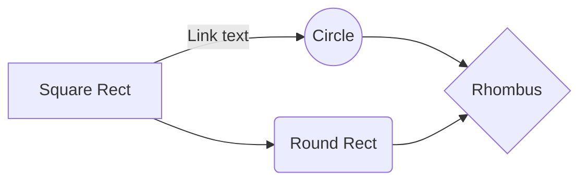

# Sample Markdown in GitHub

### BOLD
- This is<br> 
**Bold 01**<br>
__Bold 02__

***
### ITALICS
- *italicized text*

***
### BlockQuote
> Blockquote.

***
### Blockquotes Nested
> Blockquote.
>> Nested

***
### Blockquotes Elements
> Blockquote
> - Revenue was off the chart.
> - Profits were higher than ever.

***
### List Ordered
Ordered List
1. First item
2. Second item

***
### List Unordered
Unordered List
- First item
- Second item

***
### List Unordered Indented
Unordered List
- Third item
  - Indented item
  - Indented item

***
### Horizontal Rule
---
   
***
### Line Break
First line with the HTML tag after.<br>

***
### Table
| NUMBER |                ITEM           |
|:-----: | :----------------------------:|
|   1    | Test 1                        |
|   2    | Test 2                        |


***
### Strikethrough
~~The world is flat.~~ We now know that the world is round.<br>

***
### Subscript
H~2~O<br>
H<sub>2</sub>O

***
### Superscript
X^2^<br> 
X<sup>2</sup>

***
### Image


***
### Footnote
Here's a sentence with a footnote. [^1]
...
[^1]: This is the footnote.

***
### Definition
term
: definition

***
### Task List
- [x] Write the press release
- [ ] Update the website
- [ ] Contact the media

***
### Note
> __Note__
> This is a note.

***
### Warning
> __Warning__
> This is a warning.

***
### Mermaid Graph
[Link to Mermaid](https://github.com/mermaid-js/mermaid)

***
### Colored Table Sample
[Link to LaTeX](https://ashki23.github.io/markdown-latex.html)
| $$\color{black}{Black}$$ |  $$\color{blue}{Blue}$$ | $$\color{brown}{Brown}$$ | $$\color{darkgray}{Darkgray}$$  | $$\color{gray}{Gray}$$ | 
| ------------- | ------------- | ------------- | ------------- | ------------- | 
| $$\color{lightgray}{Lightgray}$$ |  $$\color{green}{Green}$$ | $$\color{brown}{Brown}$$ | $$\color{lime}{Lime}$$  | $$\color{magenta}{Magenta}$$ |
| $$\color{olive}{Olive}$$ |  $$\color{orange}{Orange}$$ | $$\color{pink}{Pink}$$ | $$\color{purple}{Purple}$$  | $$\color{red}{Red}$$ | 
| $$\color{teal}{Teal}$$ |  $$\color{violet}{Violet}$$ | $$\color{white}{White}$$ | $$\color{yellow}{Yellow}$$  | $$\color{BurntOrange}{MBurntOrange}$$ |
| $$\color{white} \colorbox{Green} {White on Green} $$   | $$\color{purple} \fcolorbox{red}{white} {Purple on White} $$  | $$\color{black} \fcolorbox{white} {red} {Black on Red} $$   | $$\color{black} \fcolorbox{red}{white} {Black on White} $$ | $$\color{black} \colorbox{BurntOrange} {orange background} $$ |
| $$\color{Magenta} \fcolorbox{red}{white} {Magenta on White} $$ |  $$\color{green} \fcolorbox{red}{white} {Green on White} $$ | $$\color{lime} \fcolorbox{white}{red} {Lime on Red} $$ |$$\color{Orange} \fcolorbox{white}{black} {Orange on Black} $$  | $$\color{blue} \fcolorbox{white}{red} {Blue on White} $$ | 

***
### Font Coloring


$\color{yellow} {This}$
$\color{yellow} {is}$
$\color{yellow} {Yellow}$

$\color{red} {This}$
$\color{red} {is}$
$\color{red} {RED}$

$\color{green} {This}$
$\color{green} {is}$
$\color{green} {GREEN}$

$\color{ligthgray} {This}$
$\color{ligthgray} {is}$
$\color{ligthgray} {LIGHT GRAY}$


***
### LaTeX Font Sizes
$\Huge Hello!$<br>
$\huge Hello!$<br>
$\LARGE Hello!$<br>
$\Large Hello!$<br>
$\large Hello!$<br>
$\normalsize Hello!$<br>
$\small Hello!$<br>
$\scriptsize Hello!$<br>
$\tiny Hello!$<br>

***
### LaTeX Font Testing

$\small \text{Font size is small} $<br>
$\small \color{red} \text{Font size is small in red} $<br>
$\normalsize \color{green} \text{Font size is normal in green} $<br>
$\large \color{yellow} \text{ALL CAPS LARGE size in YELLOW} $<br>

$\color{yellow} \mathtt{ALL CAPS LARGE size in YELLOW} $<br>
$\color{yellow} \mathsf{Sans} $
$\color{yellow} \mathsf{Font} $
$\color{yellow} \mathsf{in} $
$\color{yellow} \mathsf{yellow} $<br>

$\color{green} \mathsf{textual\ description\ of\ a\ variable}$<br>

$\color{green} \mathfrak{ABCDEFGHI}$<br>
$\color{green} \mathfrak{0123456789}$<br>

$\color{Magenta} \fcolorbox{red}{white} {Magenta on White}$<br>


$\boxed{a+b}$
$\boxed{\text{This is inside a box}}$

$\color {BurntOrange}{\textsf{Burnt Orange}}$<br>
$\forall x \in X, \quad \exists y \leq \epsilon$<br>

$\small \text{Font size is small, eg. }$
$\sum{x_i = 10}$<br>

***
### LaTeX Available Colors


$\color {Apricot}           {\text{Apricot}}$<br>
$\color {Aquamarine}        {\text{Aquamarine}}$<br>
$\color {Bittersweet}       {\text{Bittersweet}}$<br>
$\color {Blue}{\text{Blue}}$<br>
$\color {BlueGreen}{\text{BlueGreen}}$<br>
$\color {BlueViolet}{\text{BlueViolet}}$<br>
$\color {BrickRed}{\text{BrickRed}}$<br>
$\color {Brown}{\text{Brown}}$<br>
$\color {BurntOrange}{\text{BurntOrange}}$<br>
$\color {CadetBlue}{\text{CadetBlue}}$<br>
$\color {CarnationPink}{\text{CarnationPink}}$<br>
$\color {Cerulean}{\text{Cerulean}}$<br>
$\color {CornflowerBlue}{\text{CornflowerBlue}}$<br>
$\color {Cyan}{\text{Cyan}}$<br>
$\color {Dandelion}{\text{Dandelion}}$<br>
$\color {DarkOrchid}{\text{DarkOrchid}}$<br>
$\color {Emerald}{\text{Emerald}}$<br>
$\color {ForestGreen}{\text{ForestGreen}}$<br>
$\color {Fuchsia}{\text{Fuchsia}}$<br>
$\color {Goldenrod}{\text{Goldenrod}}$<br>
$\color {Gray}{\text{Gray}}$<br>
$\color {Green}{\text{Green}}$<br>
$\color {GreenYellow}{\text{GreenYellow}}$<br>
$\color {JungleGreen}{\text{JungleGreen}}$<br>
$\color {Lavender}{\text{Lavender}}$<br>
$\color {LimeGreen}{\text{LimeGreen}}$<br>
$\color {Magenta}{\text{Magenta}}$<br>
$\color {Mahogany}{\text{Mahogany}}$<br>
$\color {Maroon}{\text{Maroon}}$<br>
$\color {Melon}{\text{Melon}}$<br>
$\color {MidnightBlue}{\text{MidnightBlue}}$<br>
$\color {Mulberry}{\text{Mulberry}}$<br>
$\color {NavyBlue}{\text{NavyBlue}}$<br>
$\color {OliveGreen}{\text{OliveGreen}}$<br>
$\color {Orange}{\text{Orange}}$<br>
$\color {OrangeRed}{\text{OrangeRed}}$<br>
$\color {Orchid}{\text{Orchid}}$<br>
$\color {Peach}{\text{Peach}}$<br>
$\color {Periwinkle}{\text{Periwinkle}}$<br>
$\color {PineGreen}{\text{PineGreen}}$<br>
$\color {Plum}{\text{Plum}}$<br>
$\color {ProcessBlue}{\text{ProcessBlue}}$<br>
$\color {Purple}{\text{Purple}}$<br>
$\color {RawSienna}{\text{RawSienna}}$<br>
$\color {Red}{\text{Red}}$<br>
$\color {RedOrange}{\text{RedOrange}}$<br>
$\color {RedViolet}{\text{RedViolet}}$<br>
$\color {Rhodamine}{\text{Rhodamine}}$<br>
$\color {RoyalBlue}{\text{RoyalBlue}}$<br>
$\color {RoyalPurple}{\text{RoyalPurple}}$<br>
$\color {RubineRed}{\text{RubineRed}}$<br>
$\color {Salmon}{\text{Salmon}}$<br>
$\color {SeaGreen}{\text{SeaGreen}}$<br>
$\color {Sepia}{\text{Sepia}}$<br>
$\color {SkyBlue}{\text{SkyBlue}}$<br>
$\color {SpringGreen}{\text{SpringGreen}}$<br>
$\color {Tan}{\text{Tan}}$<br>
$\color {TealBlue}{\text{TealBlue}}$<br>
$\color {Thistle}{\text{Thistle}}$<br>
$\color {Turquoise}{\text{Turquoise}}$<br>
$\color {Violet}{\text{Violet}}$<br>
$\color {VioletRed}{\text{VioletRed}}$<br>
$\color {White}{\text{White}}$<br>
$\color {WildStrawberry}{\text{WildStrawberry}}$<br>
$\color {Yellow}{\text{Yellow}}$<br>
$\color {YellowGreen}{\text{YellowGreen}}$<br>
$\color {YellowOrange}{\text{YellowOrange}}$<br>


***
### DIFF

```diff
+ This is Addition
- This is Substraction
! This is Excamation
* This is Multiplication
/ This is division

@@ Always Pink @@
```
***
### Code
This is `code`

***
### Code Language HTML
```html
<body>
  <div class="loader"></div>
  <div class="pause">Click To Pause</div>
</body>

```

***
### Github Refrerence

[Link to GitHub Doc](https://docs.github.com/en/get-started/writing-on-github/getting-started-with-writing-and-formatting-on-github/basic-writing-and-formatting-syntax#GitHub-flavored-Markdown)

***
### End

$
\begin{array}{c|c}
  1 & 2 \\ 
  \hline
  3 & 4
 \end{array}
$<br>

